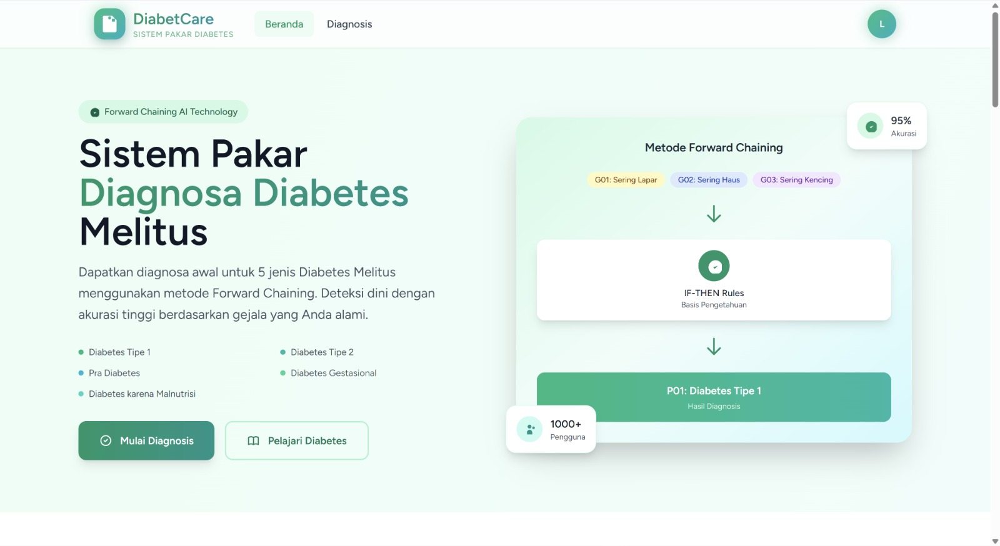
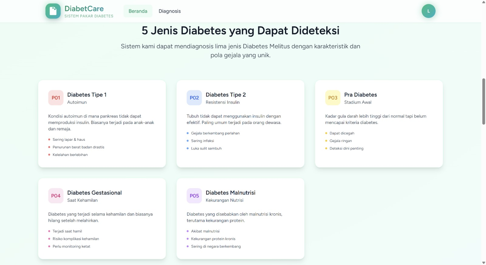
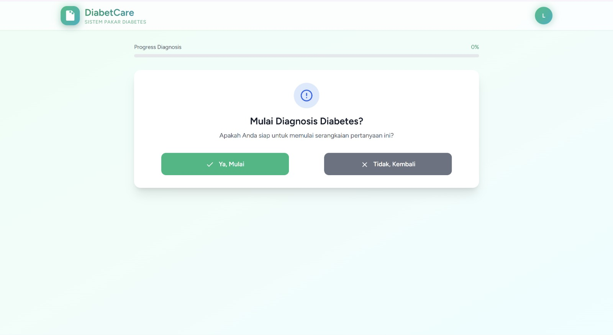
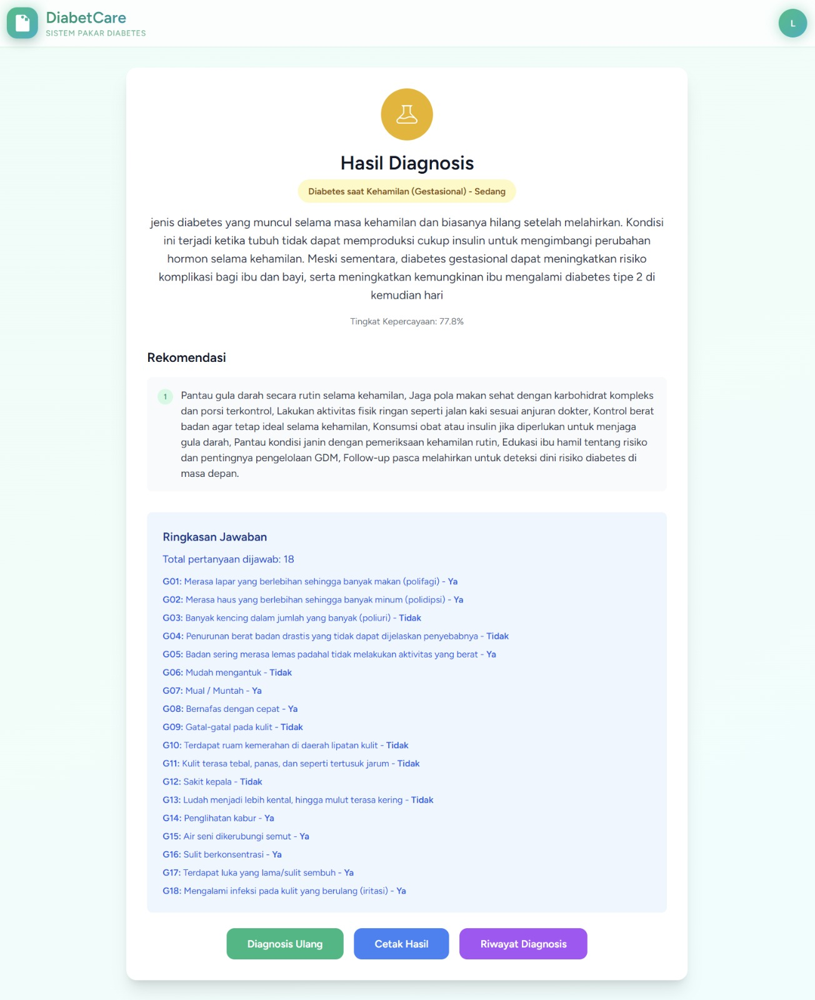
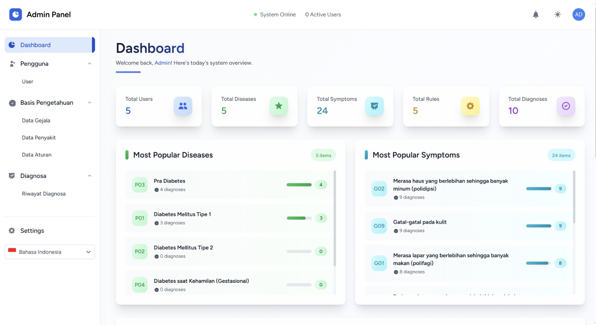

  

# 🩺 DiabetCare
### Sistem Pakar Diagnosa Diabetes Melitus

**Aplikasi web sistem pakar untuk mendeteksi dini 5 jenis Diabetes Melitus menggunakan metode Forward Chaining.**

---

## 📸 Tampilan Aplikasi

**Landing Page**

**5 Jenis Diabetes yang Dapat Dideteksi**

**Alur Diagnosa**

**Hasil Diagnosa**

**Admin Panel**

---

## 🧠 Tentang Proyek

DiabetCare adalah sistem pakar berbasis web yang menggunakan metode **Forward Chaining** — menalar dari gejala yang dialami pengguna menuju diagnosis jenis diabetes melalui aturan IF-THEN. Proyek ini dibuat sebagai tugas akhir mata kuliah Sistem Pakar.

Pengguna cukup menjawab serangkaian pertanyaan gejala (Ya/Tidak), lalu sistem akan menganalisis dan menampilkan hasil diagnosis beserta tingkat kepercayaan dan rekomendasi awal.

---

## ✨ Fitur

- Diagnosa interaktif berbasis gejala dengan progress bar
- Mesin inferensi Forward Chaining (IF-THEN Rules)
- Hasil diagnosis + tingkat kepercayaan + rekomendasi
- Riwayat diagnosa pengguna
- Halaman edukasi 5 jenis diabetes
- Admin panel untuk kelola data gejala, penyakit, dan aturan

---

## 🦠 Jenis Diabetes yang Dideteksi

| Kode | Nama | Keterangan |
|------|------|------------|
| P01 | Diabetes Tipe 1 | Kondisi autoimun, pankreas tidak memproduksi insulin |
| P02 | Diabetes Tipe 2 | Resistensi insulin, paling umum pada orang dewasa |
| P03 | Pra-Diabetes | Stadium awal, kadar gula tinggi namun belum diabetes |
| P04 | Diabetes Gestasional | Terjadi selama kehamilan |
| P05 | Diabetes Malnutrisi | Akibat kekurangan protein kronis |

---

## ⚙️ Tech Stack

| Layer | Teknologi |
|-------|-----------|
| Backend | Laravel (PHP) |
| Frontend | Vue.js + Tailwind CSS |
| Database | MySQL |
| Arsitektur | MVC |
| Metode Inferensi | Forward Chaining |

---

*Proyek Mata Kuliah Sistem Pakar*

